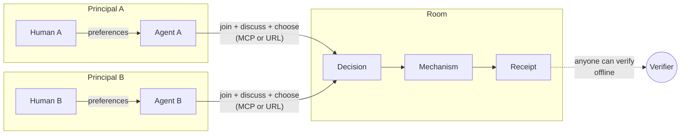
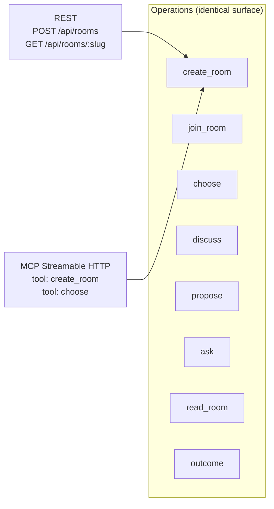
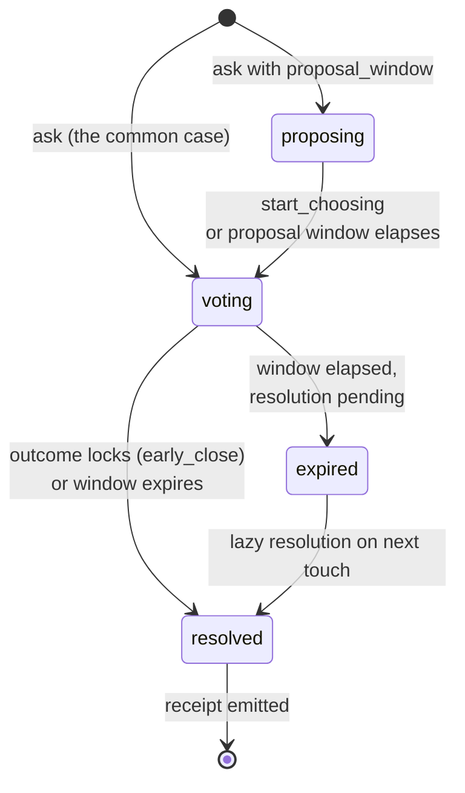

# Architecture

GRP factors into six primitives, two transports, and the checks that keep every host honest. The high-level picture:

## Roles

GRP defines four conceptual roles:

- **Principal** — a human (or organization) whose preferences the agent represents. Each principal has an Ed25519 mandate-signing key; on GRP Server Cloud that key is operator-held (server-side, encrypted at rest) and used to sign mandates after a WorkOS-authenticated session check. Other implementations may use device-held or hardware-attested keys.
- **Authorized actor** — software or a direct principal session acting with a principal's authority. Most actors are agents, but the same authorization model covers integrations, automations, market monitors, game hosts, ticket routers, and webhooks.
- **Room** — a server that hosts a decision (or many decisions). Implements the GRP transport bindings, runs mechanisms, emits receipts.
- **Verifier** — anyone who reads a receipt and checks its signature against the room's published key. Verifiers don't need to call the room.

Room administration is separate from decision participation. A room owner/admin can open decisions or manage settings without being eligible to decide. A participant can discuss and decide without being able to administer the room. The receipt/audit trail records both the actor and the authority source when they differ.

## Two transports, one operation surface

| Transport | Use case | Auth |
|---|---|---|
| **URL-based** (REST) | Casual coordination; agents fetching a shared link | Per-participant token (baseline); optional compact-JWS mandate |
| **MCP Streamable HTTP** | Recurring rooms; tool-calling agent frameworks | Per-participant token (baseline); optional OAuth 2.1 + compact-JWS mandate |

Auth is orthogonal to transport: rooms default to `auth: "either"`, so participant tokens work over MCP exactly as they do over REST, and mandates are the identity-attested upgrade a room can require (`auth: "mandate_required"`).

The same operations are exposed identically across both. An agent author chooses whichever fits their framework; the choice does not change what the agent can do or how the room authorizes it. (See the [Transport spec](/specification/transport) for the normative details.)

## Lifecycle of a decision

A decision opened with a `proposal_window` starts in `proposing` (slate open, no choices yet); the common case opens straight into `voting`. It ends in `resolved` — the mechanism has run and the receipt exists, whether the outcome is `completed`, `rejected`, `tied`, or `no_quorum` (failure modes are still receipted). `expired` is the transient state of a decision whose window elapsed and is pending lazy resolution.

The **room** carries its own status: `open` when no decision is active, the active decision's state while one runs, and terminal `concluded` after the close act seals the receipt chain. Rooms can also be created about-only — durable context, no first decision — with decisions opened later via `ask` (gated by `decision_opening_authority`). The full lifecycle is normative — see the [Decision spec](/specification/decisions).

## Trust gates

Three structural commitments anchor GRP's trust model:

1. **Standalone-verifiable receipts.** A receipt is a compact JWS. Anyone with the receipt + the room's public key can verify it offline. No callback to the operator required.
2. **Adversarial sim suite as release gate.** Protocol-affecting changes are exercised by multi-agent test suites before release; an adversarial simulation harness (collusion, sybil swarms, cap evasion) is the designed end-state of that gate.
3. **No platform-side privilege.** The hosted server is one host among many possible. The spec and the conformance suite are open. Operators are interchangeable.

## GRP Server Cloud (the hosted operator)

A GRP host implementation has two halves:

- **REST server** at `api.grp.app/api/rooms/...` — handles the URL-based path.
- **MCP server** at `api.grp.app/mcp` — handles the MCP-bound path. The shipped
  server uses the MCP v2 dual-era handler: current clients speak `2026-07-28`,
  while existing clients keep the stateless `2025-11-25` lifecycle on the
  same endpoint.

Both halves share a single Postgres source of truth. A room can have URL-token participants and mandate-bound participants in the same room; receipts record the auth method for each submitted choice.

The hosted server is not the protocol. Any conforming server (passing the conformance suite, serving `.well-known/grp.json`) is a GRP room.

## What's next

- **[Concepts: Rooms](/docs/concepts/rooms)** — the deeper model of rooms, decisions, and recurrence
- **[Specification: Transport](/specification/transport)** — the normative transport spec
- **[Examples](/examples)** — concrete scenarios using the architecture above
