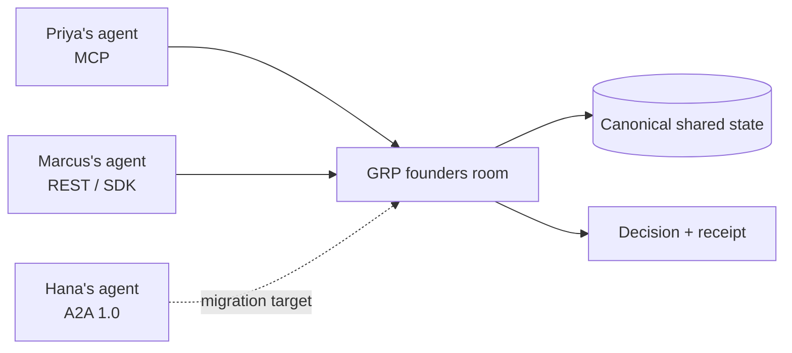

# A2A participant — migration target

> **Not a runnable A2A 1.0 example yet.** GRP Server Cloud's experimental
> `/a2a` endpoint uses a pre-1.0 A2A draft shape. The intended composition has
> been exercised through that legacy adapter, but a current A2A 1.0 client will
> not connect without migration work.

## The intended room

A three-person founding team keeps a standing GRP room for company decisions:

- Priya's agent uses GRP over MCP.
- Marcus's custom agent uses the GRP TypeScript SDK over REST.
- Hana's enterprise agent speaks current A2A.

All three should participate in one canonical room. Hana's agent should not
message Priya's and Marcus's agents separately or maintain a peer mesh. It
should address the GRP host through a current A2A interface; the host should map
that point-to-point exchange onto Hana's seat in the shared room.

The layering is the point:

- A2A connects Hana's agent client to the remote GRP host.
- GRP gives all three agents the shared room, membership, conversation,
  closing rule, and outcome.
- The receipt is identical regardless of the envelope each participant used.

## What ships today

The current experimental endpoint exposes older draft methods such as
`tasks/send`, `tasks/get`, and `tasks/cancel`, along with a legacy Agent Card.
It delegates into the same GRP room service as REST and MCP, so the internal
architecture has demonstrated mixed-envelope fan-in against one room state.

That does **not** establish current A2A interoperability. A current A2A 1.0
binding uses different operation names, discovery/version declarations, and
object shapes. Calling the legacy method names "standard A2A" or describing a
stock enterprise A2A client as a first-class participant would be false.

See [A2A integration status](/reference/a2a) for the exact boundary and
[the legacy endpoint contract](/specification/interop/a2a) for the surface that
is currently deployed.

## Migration acceptance test

This example becomes runnable only when all of the following are true:

1. The host publishes a current A2A Agent Card with a versioned JSON-RPC or
   HTTP+JSON interface.
2. A current official A2A SDK discovers the host without a GRP-specific
   transport adapter.
3. `SendMessage` joins Hana to her existing GRP participant seat and carries
   discussion plus a structured choice through the GRP extension.
4. `GetTask` exposes the native GRP lifecycle without inventing a parallel
   source of decision state.
5. The completed task returns the byte-identical compact-JWS receipt available
   to the MCP and REST participants.
6. Auth, cancellation, errors, streaming/push claims, and protocol-version
   negotiation pass current A2A conformance tests against a live host.

Until that gate closes, REST and MCP are the supported GRP transports. The
mixed-protocol room remains an important target, not a shipped compatibility
claim.
